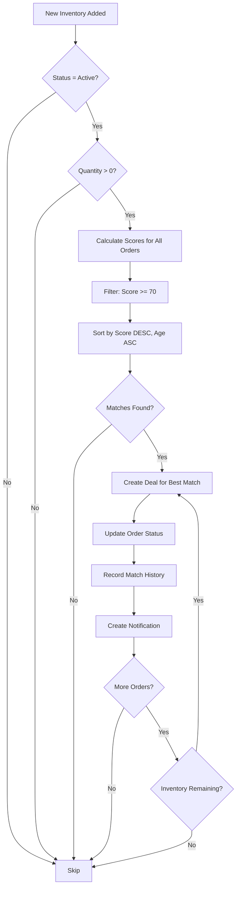

# AI-Powered Inventory Matching System

## Overview

This document describes the intelligent AI-powered matching system that automatically matches orders with inventory using advanced scoring algorithms and machine learning-inspired techniques.

---

## System Architecture

### Core Components

1. **AI Scoring Engine** - Calculates match quality using weighted factors
2. **Smart Auto-Matching** - Automatically creates deals for high-quality matches
3. **Intelligent Notifications** - Alerts users about matches in real-time
4. **Analytics Dashboard** - Tracks matching performance and insights

---

## AI Scoring Algorithm

### Scoring Factors (Weighted)

The AI evaluates 6 key factors to determine match quality:

#### 1. Quality Match Score (25% weight)
- **100 points**: Exact quality match (A = A, B = B, etc.)
- **80 points**: Close quality match accepted (difference of 1 grade)
- **50 points**: Quality difference acceptable (difference of 2 grades)
- **0 points**: Quality mismatch rejected

**Logic:**
```
IF order.quality == batch.quality THEN
  score = 100
ELSIF order.accept_close_quality AND diff <= 1 THEN
  score = 80
ELSIF order.accept_close_quality AND diff == 2 THEN
  score = 50
ELSE
  NO MATCH
```

#### 2. Price Competitiveness Score (20% weight)
Compares actual price against dynamic market price:

- **100 points**: 15%+ below market price (excellent deal)
- **90 points**: 5-14% below market price (good deal)
- **80 points**: Within ±5% of market price (fair)
- **60 points**: 6-15% above market price (slightly premium)
- **40 points**: 15%+ above market price (premium)

**Formula:**
```
price_ratio = actual_price / expected_price
score = f(price_ratio)
```

#### 3. Location Proximity Score (20% weight)
- **100 points**: Same city delivery
- **70 points**: Nearby city (when accept_close_city = true)
- **0 points**: Location mismatch rejected

#### 4. Quantity Fulfillment Score (15% weight)
- **100 points**: Full order quantity available
- **60-100 points**: Partial quantity available (scaled by percentage)
- **0 points**: Insufficient quantity rejected

**Formula:**
```
IF available >= required THEN
  score = 100
ELSIF accept_partial THEN
  score = 60 + (40 * available / required)
ELSE
  NO MATCH
```

#### 5. Supplier Trust Rating Score (10% weight)
Based on supplier's historical performance:

- **100 points**: Rating ≥ 90 (excellent supplier)
- **80 points**: Rating 75-89 (good supplier)
- **60 points**: Rating 50-74 (average supplier)
- **40 points**: Rating < 50 (new/low-rated supplier)

#### 6. Inventory Freshness Score (10% weight)
Rewards recently listed inventory:

- **100 points**: Listed within 1 hour (brand new)
- **90 points**: Listed within 6 hours (very recent)
- **80 points**: Listed within 24 hours (recent)
- **60 points**: Listed within 72 hours (available for days)
- **40 points**: Older than 72 hours (older inventory)

### Final Score Calculation

```sql
total_score = (
  quality_score * 0.25 +
  price_score * 0.20 +
  location_score * 0.20 +
  quantity_score * 0.15 +
  supplier_score * 0.10 +
  freshness_score * 0.10
)
```

### Score Interpretation

- **90-100**: Excellent Match - Highly recommended
- **80-89**: Great Match - Very good option
- **75-79**: Good Match - Acceptable option
- **70-74**: Fair Match - Consider alternatives
- **< 70**: Weak Match - Not recommended

---

## Database Schema

### New Tables

#### `matching_scores`
Stores calculated match scores with detailed breakdown:

```sql
CREATE TABLE matching_scores (
  id uuid PRIMARY KEY,
  order_id uuid REFERENCES orders(id),
  batch_id uuid REFERENCES inventory_batches(id),
  score numeric,
  quality_score numeric,
  price_score numeric,
  location_score numeric,
  quantity_score numeric,
  supplier_rating_score numeric,
  freshness_score numeric,
  match_reasons jsonb,
  created_at timestamptz,
  UNIQUE(order_id, batch_id)
);
```

#### `match_history`
Tracks match acceptance/rejection for learning:

```sql
CREATE TABLE match_history (
  id uuid PRIMARY KEY,
  order_id uuid,
  batch_id uuid,
  score numeric,
  was_accepted boolean,
  rejection_reason text,
  created_at timestamptz
);
```

#### `smart_notifications`
Intelligent notification system:

```sql
CREATE TABLE smart_notifications (
  id uuid PRIMARY KEY,
  user_phone text,
  notification_type text,
  title text,
  message text,
  priority text,
  related_order_id uuid,
  related_batch_id uuid,
  match_score numeric,
  metadata jsonb,
  is_read boolean,
  created_at timestamptz
);
```

---

## Key Functions

### 1. `calculate_match_score(order_id, batch_id)`
Calculates comprehensive match score for an order-batch pair.

**Returns:**
- Overall score (0-100)
- Individual factor scores
- Detailed match reasons (JSONB)

**Usage:**
```sql
SELECT * FROM calculate_match_score(
  'order-uuid',
  'batch-uuid'
);
```

### 2. `get_best_matches_for_order(order_id, limit)`
Returns top N matches for an order, sorted by score.

**Returns:**
- Batch details
- All scoring factors
- Match reasons with explanations
- Batch metadata (images, description, etc.)

**Usage:**
```sql
SELECT * FROM get_best_matches_for_order(
  'order-uuid',
  5  -- top 5 matches
);
```

### 3. `smart_auto_match_orders(batch_id)`
Automatically matches new inventory with waiting orders.

**Process:**
1. Calculates scores for all compatible orders
2. Filters matches with score ≥ 70
3. Sorts by score (highest first) and order age
4. Creates deals for best matches
5. Updates order status to 'matched'
6. Records match history

**Usage:**
```sql
SELECT * FROM smart_auto_match_orders('batch-uuid');
```

### 4. `create_match_notification()`
Generates intelligent notifications for users.

**Notification Types:**
- `match_found`: New match discovered
- `better_match`: Superior match available
- `inventory_alert`: New inventory matches order
- `score_update`: Match scores recalculated

**Priority Levels:**
- `high`: Score ≥ 85
- `medium`: Score 70-84
- `low`: Score < 70

---

## Auto-Matching Workflow

### Trigger Flow



### Matching Priority

Orders are matched based on:
1. **Score** (highest first)
2. **Age** (oldest first if scores equal)
3. **Quantity** (full orders before partial)

---

## Smart Notifications

### Notification System Features

1. **Real-time Alerts**: WebSocket-based instant notifications
2. **Priority-based**: High-priority matches shown first
3. **Rich Context**: Includes order/batch details and reasons
4. **Read Status**: Track which notifications user has seen
5. **Action Links**: Direct links to view matches

### Notification Triggers

Notifications are created when:
- High-score match found (≥75)
- Better match becomes available
- New inventory matches order criteria
- Match scores are updated

### Example Notification

```json
{
  "type": "match_found",
  "priority": "high",
  "title": "Excellent Match Found!",
  "message": "AI found a perfect match (92%) for your خشبية order. 50 pallets available in الرياض.",
  "match_score": 92,
  "metadata": {
    "quality_score": 100,
    "price_score": 85,
    "location_score": 100
  }
}
```

---

## Analytics & Insights

### Tracking Metrics

The system tracks:
- Total matches analyzed
- Successful matches (accepted)
- Failed matches (rejected)
- Average scores per factor
- Score distribution
- Success rates

### AI Insights

The analytics dashboard provides:
- **Performance Assessment**: Overall matching quality
- **Factor Analysis**: Which factors drive success
- **Improvement Suggestions**: Areas to optimize
- **Pattern Recognition**: Learning from past matches

### Example Insights

```
✓ Excellent matching performance - AI finding high-quality matches
✓ Competitive pricing driving successful matches
⚠ Consider reviewing quality matching criteria
⚠ Low success rate - investigate rejection reasons
```

---

## Frontend Components

### 1. SmartMatchingPanel
Location: `src/components/dashboard/SmartMatchingPanel.tsx`

Shows AI-recommended matches for an order with:
- Visual score indicators
- Factor breakdowns
- Expandable details
- One-click selection

**Usage:**
```tsx
<SmartMatchingPanel
  orderId="order-uuid"
  onSelectMatch={(batchId, score) => {
    // Handle match selection
  }}
/>
```

### 2. MatchingAnalytics
Location: `src/components/admin/analytics/MatchingAnalytics.tsx`

Admin dashboard showing:
- Key performance metrics
- Score distributions
- Factor analysis
- AI insights

### 3. NotificationCenter
Location: `src/components/shared/NotificationCenter.tsx`

Real-time notification center with:
- Unread count badge
- Priority indicators
- Match details
- Mark as read functionality

**Usage:**
```tsx
<NotificationCenter phone="966501234567" />
```

---

## API Usage Examples

### Get Best Matches

```typescript
const { data, error } = await supabase.rpc('get_best_matches_for_order', {
  p_order_id: orderId,
  p_limit: 5
});

// Returns top 5 matches with scores and details
```

### Get User Notifications

```typescript
const { data, error } = await supabase.rpc('get_user_notifications', {
  p_phone: '966501234567',
  p_limit: 50,
  p_unread_only: false
});
```

### Mark Notification as Read

```typescript
const { error } = await supabase.rpc('mark_notification_read', {
  p_notification_id: notificationId
});
```

---

## Performance Optimizations

### Database Indexes

```sql
-- Matching scores lookups
CREATE INDEX idx_matching_scores_order_score
  ON matching_scores(order_id, score DESC);

-- Notification queries
CREATE INDEX idx_smart_notifications_user_phone
  ON smart_notifications(user_phone, created_at DESC);

-- Match history analysis
CREATE INDEX idx_match_history_created
  ON match_history(created_at DESC);
```

### Query Optimization

- Scores calculated on-demand, not pre-stored
- Use of LATERAL joins for efficient calculations
- Batch processing for multiple orders
- Indexed filtering reduces scan time

---

## Security

### Row Level Security (RLS)

All tables have RLS enabled:

```sql
-- Users see only their own data
CREATE POLICY "Users can view own notifications"
  ON smart_notifications FOR SELECT
  USING (user_phone = current_user_phone());

-- Admins see everything
CREATE POLICY "Admins can view all"
  ON smart_notifications FOR SELECT
  USING (is_admin());
```

### Function Security

Functions use `SECURITY DEFINER` with proper validation:
- Phone number verification
- Order ownership checks
- Batch availability validation
- Prevent self-matching

---

## Future Enhancements

### Phase 2 Features

1. **Machine Learning Integration**
   - Learn from accepted/rejected matches
   - Adjust weights based on user preferences
   - Predict match success probability

2. **Advanced Filtering**
   - Custom scoring preferences per user
   - Industry-specific matching rules
   - Time-based urgency factors

3. **Smart Recommendations**
   - Suggest order modifications for better matches
   - Recommend inventory adjustments
   - Predict demand patterns

4. **A/B Testing**
   - Test different scoring algorithms
   - Compare matching strategies
   - Optimize weights dynamically

---

## Troubleshooting

### Common Issues

**Q: Matches not being found automatically**
- Check inventory status is 'active'
- Verify available_quantity > 0
- Ensure order status is 'unmatched' or 'pending'
- Check quality/city flexibility settings

**Q: Low match scores**
- Review pricing competitiveness
- Check supplier ratings
- Verify quality grade compatibility
- Consider location flexibility

**Q: Notifications not appearing**
- Check notification threshold (must be ≥75 score)
- Verify realtime subscription active
- Check user phone matches order phone

---

## Configuration

### Score Thresholds

Adjust in migration file:

```sql
-- Minimum score for auto-matching
WHERE ms.score >= 70

-- Notification trigger threshold
IF NEW.score >= 75 THEN
```

### Weight Adjustments

Modify in `calculate_match_score` function:

```sql
v_total_score := (
  v_quality_score * 0.25 +  -- Adjust weights here
  v_price_score * 0.20 +
  v_location_score * 0.20 +
  v_quantity_score * 0.15 +
  v_supplier_score * 0.10 +
  v_freshness_score * 0.10
);
```

---

## Monitoring

### Health Checks

Monitor these metrics:
- Average match score trend
- Success rate over time
- Notification delivery rate
- Function execution time
- Database query performance

### Alerts

Set up alerts for:
- Success rate drops below 60%
- Average score drops below 75
- High number of failed matches
- Slow query performance

---

## Conclusion

This AI-powered matching system provides:

✅ **Intelligent Scoring**: Multi-factor weighted algorithm
✅ **Automatic Matching**: Real-time deal creation
✅ **Smart Notifications**: Priority-based user alerts
✅ **Performance Analytics**: Data-driven insights
✅ **Learning Capability**: Historical match tracking

The system significantly improves matching accuracy and reduces manual intervention, creating a seamless experience for both buyers and suppliers.

---

## Support

For technical questions or issues:
1. Check this documentation
2. Review migration files in `supabase/migrations/`
3. Examine component implementations
4. Test functions using SQL queries

**Key Files:**
- Migration: `create_ai_powered_matching_system.sql`
- Notifications: `create_smart_notification_system.sql`
- Components: `src/components/dashboard/SmartMatchingPanel.tsx`
- Analytics: `src/components/admin/analytics/MatchingAnalytics.tsx`
