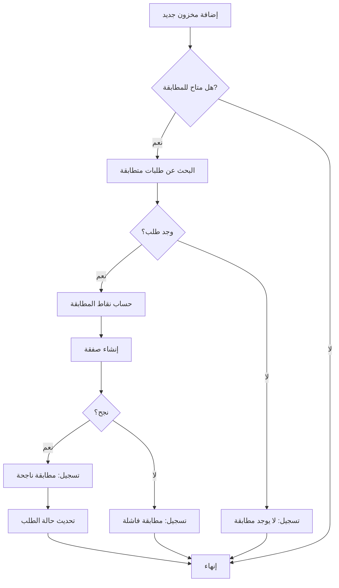
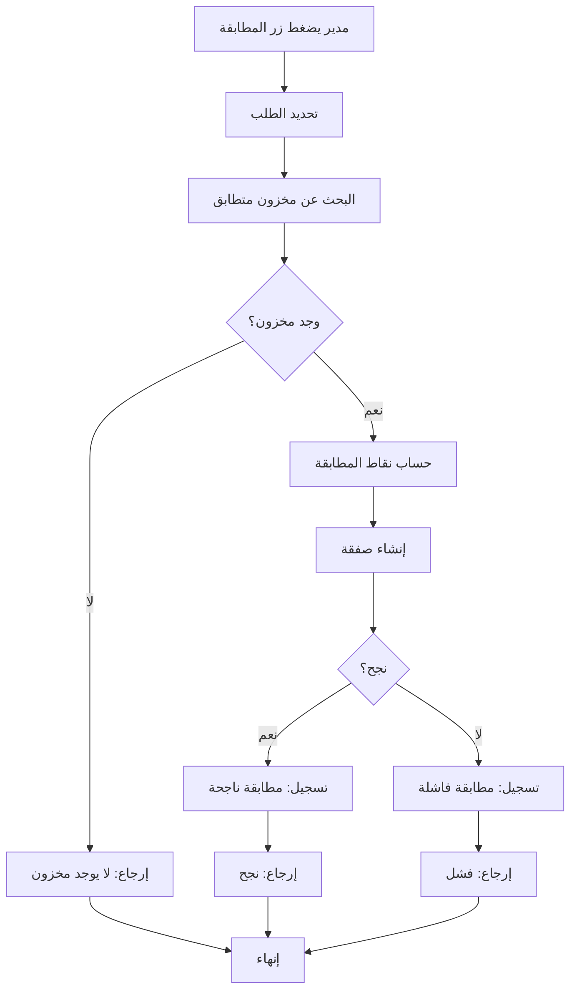

# نظام المطابقة الذكية المتطور - التوثيق الشامل

## نظرة عامة

تم **إعادة بناء وتطوير** نظام المطابقة الذكية بالكامل ليصبح نظاماً متكاملاً ومبتكراً يربط جميع أقسام المنصة (المخزون، الطلبات، الصفقات) مع تتبع فوري وتحليلات متقدمة.

---

## الميزات الرئيسية

### 1. مركز التحكم الذكي (Control Center)
لوحة تحكم متطورة تتضمن:

#### إحصائيات فورية
- **مطابقات اليوم**: عدد المطابقات الناجحة خلال اليوم
- **نسبة النجاح**: النسبة المئوية للمطابقات الناجحة
- **متوسط الوقت**: وقت معالجة المطابقة بالثواني
- **طلبات معلقة**: عدد الطلبات التي تنتظر المطابقة
- **مخزون نشط**: عدد المخازن المتاحة للمطابقة
- **مطابقات محتملة**: عدد المطابقات المحتملة الحالية

#### لوحة التحكم التفاعلية
- **تشغيل/إيقاف المطابقة التلقائية**: زر تبديل سريع
- **مطابقة جماعية**: معالجة جميع الطلبات المعلقة دفعة واحدة
- **مراقبة الحالة**: عرض حالة النظام (نشط/متوقف)
- **مؤشرات الأداء**: الكفاءة، الأداء، حالة النظام

#### الطلبات المعلقة (Pending Orders)
- عرض تفصيلي لكل طلب معلق
- تحديد الطلبات العاجلة (+24 ساعة انتظار)
- عدد المطابقات المحتملة لكل طلب
- **زر تشغيل المطابقة** لكل طلب فردي
- تحديث تلقائي كل 30 ثانية

#### المطابقات الأخيرة (Recent Matches)
- عرض آخر 10 محاولات مطابقة
- حالة كل مطابقة (نجحت/فشلت/معلقة)
- نقاط المطابقة (Match Score)
- وقت المعالجة بالميلي ثانية
- تفاصيل المنتج والموقع

---

## الربط مع الأقسام

### 1. الربط مع إضافة المخزون

عند إضافة مخزون جديد:
```
1. المورد يضيف مخزون جديد
   ↓
2. Trigger تلقائي يبحث عن طلبات متطابقة
   ↓
3. يتم حساب نقاط المطابقة
   ↓
4. إنشاء صفقة تلقائياً
   ↓
5. تسجيل المحاولة في جدول التحليلات
```

**الدالة المستخدمة:**
```sql
auto_match_order_on_inventory_insert()
```

**ما يتم تسجيله:**
- معلومات الطلب والمخزون
- نقاط المطابقة
- وقت المعالجة
- حالة النجاح/الفشل
- عوامل المطابقة (quality_match, condition_match, city_match)

### 2. الربط مع إنشاء الطلبات

عند إنشاء طلب جديد:
```
1. المشتري يضع طلب جديد
   ↓
2. النظام يفحص المخزون المتاح
   ↓
3. إذا وجد مطابقة → إنشاء صفقة تلقائياً
   ↓
4. تسجيل المحاولة مع التفاصيل
```

### 3. الربط مع الصفقات

كل صفقة يتم إنشاؤها:
```
1. إنشاء صفقة (يدوي أو تلقائي)
   ↓
2. Trigger يسجل المطابقة في جدول التحليلات
   ↓
3. تحديث إحصائيات النظام فوراً
```

**Trigger:**
```sql
trigger_log_deal_creation
```

---

## التحديثات الفورية (Realtime)

النظام يستخدم Supabase Realtime للتحديث الفوري:

```typescript
const channel = supabase
  .channel('matching-control-center')
  .on('postgres_changes', { event: '*', table: 'deals' }, loadAllData)
  .on('postgres_changes', { event: '*', table: 'orders' }, loadAllData)
  .on('postgres_changes', { event: '*', table: 'inventory_batches' }, loadAllData)
  .on('postgres_changes', { event: '*', table: 'matching_analytics' }, loadRecentMatches)
  .subscribe();
```

**التحديثات تشمل:**
- إضافة/تعديل صفقة → تحديث الإحصائيات
- إضافة/تعديل طلب → تحديث قائمة الانتظار
- إضافة/تعديل مخزون → تحديث المخزون النشط
- أي محاولة مطابقة → ظهور فوري في المطابقات الأخيرة

---

## قاعدة البيانات

### الجداول

#### 1. matching_analytics
جدول تسجيل جميع محاولات المطابقة:

```sql
CREATE TABLE matching_analytics (
  id uuid PRIMARY KEY,
  order_id uuid REFERENCES orders(id),
  batch_id uuid REFERENCES inventory_batches(id),
  match_score numeric DEFAULT 0,
  match_status text CHECK (match_status IN ('pending', 'matched', 'failed')),
  pallet_type text NOT NULL,
  size text NOT NULL,
  quality text NOT NULL,
  quantity integer NOT NULL,
  city text NOT NULL,
  buyer_phone text,
  supplier_phone text,
  processing_time_ms integer DEFAULT 0,
  match_factors jsonb DEFAULT '{}',
  created_at timestamptz DEFAULT now()
);
```

**الفهارس:**
- `idx_matching_analytics_created` على created_at
- `idx_matching_analytics_status` على match_status
- `idx_matching_analytics_buyer` على buyer_phone
- `idx_matching_analytics_supplier` على supplier_phone

### الدوال الرئيسية

#### 1. get_matching_hub_stats()
```typescript
Returns: {
  total_matches_today: number
  success_rate: number
  avg_match_time_seconds: number
  pending_orders: number
  active_inventory: number
  potential_matches: number
}
```

**الاستخدام:**
```typescript
const { data } = await supabase.rpc('get_matching_hub_stats');
```

#### 2. get_pending_orders_with_potential_matches(p_phone?)
```typescript
Returns: Array<{
  id: uuid
  request_id: string
  pallet_type: string
  size: string
  quality: string
  quantity: number
  city: string
  status: string
  created_at: timestamp
  potential_matches_count: number
  waiting_time_hours: number
}>
```

**الاستخدام:**
```typescript
const { data } = await supabase.rpc('get_pending_orders_with_potential_matches');
```

#### 3. log_matching_attempt()
تسجيل محاولة مطابقة:

```typescript
await supabase.rpc('log_matching_attempt', {
  p_order_id: orderId,
  p_batch_id: batchId,
  p_match_score: 95,
  p_match_status: 'matched',
  p_pallet_type: 'خشبي',
  p_size: '100x120',
  p_quality: 'A',
  p_quantity: 50,
  p_city: 'الرياض',
  p_buyer_phone: '0500000000',
  p_supplier_phone: '0511111111',
  p_processing_time_ms: 150,
  p_match_factors: {
    quality_match: true,
    condition_match: true,
    city_match: true,
    auto_matched: true
  }
});
```

#### 4. manual_match_existing_orders(p_order_id)
مطابقة يدوية لطلب محدد:

```typescript
const { data } = await supabase.rpc('manual_match_existing_orders', {
  p_order_id: orderId
});

// Returns: { success: boolean, deal_id: uuid, message: string }
```

---

## آلية عمل النظام

### 1. المطابقة التلقائية



### 2. المطابقة اليدوية



---

## حساب نقاط المطابقة

النظام يحسب نقاط المطابقة بناءً على:

```typescript
let match_score = 100;

// تطابق النوع (إلزامي)
if (pallet_type matches) score = 100
else return no_match

// تطابق الحجم (إلزامي)
if (size matches) score = 100
else return no_match

// تطابق الجودة (إلزامي)
if (quality matches) score = 100
else return no_match

// تطابق المدينة (إلزامي)
if (city matches) score = 100
else return no_match

// تطابق الحالة (اختياري)
if (condition matches) score += 0
else score -= 5

// مطابقة يدوية (bonus)
if (manual_match) score = 95 (minimum)
```

---

## المكونات (Components)

### 1. MatchingControlCenter
المكون الرئيسي في لوحة التحكم:

**الموقع:**
```
src/components/admin/matching/MatchingControlCenter.tsx
```

**الميزات:**
- إحصائيات فورية (6 بطاقات)
- لوحة تحكم تفاعلية
- قائمة الطلبات المعلقة
- المطابقات الأخيرة
- أزرار التحكم (تشغيل/إيقاف/مطابقة جماعية)

**الاستخدام:**
```tsx
<MatchingControlCenter />
```

### 2. MatchingSection
المكون الحاوي الرئيسي:

**الموقع:**
```
src/components/admin/sections/MatchingSection.tsx
```

**التبويبات:**
- مركز التحكم (Control Center)
- قواعد المطابقة
- القائمة السوداء
- الأداء
- الأنماط
- الأدوات اليدوية

---

## الأمان (Security)

### Row Level Security (RLS)

#### جدول matching_analytics
```sql
-- قراءة للجميع (للمراقبة)
CREATE POLICY "Anyone can view matching analytics"
  ON matching_analytics FOR SELECT
  USING (true);

-- كتابة للنظام فقط
CREATE POLICY "System can insert matching analytics"
  ON matching_analytics FOR INSERT
  WITH CHECK (true);
```

### الأذونات
- **المسؤولون**: وصول كامل لجميع البيانات والأدوات
- **المستخدمون**: وصول محدود لبياناتهم فقط
- **النظام**: صلاحيات SECURITY DEFINER للدوال الحساسة

---

## التكامل مع الواجهات الأخرى

### 1. لوحة التحكم الرئيسية
```typescript
// في AdminPanel.tsx
{section === 'matching' && <MatchingSection />}
```

### 2. مركز المطابقة الذكية المستقل
```typescript
// في App.tsx
{modal === 'matchingHub' && (
  <MatchingHub
    phone={session?.profile?.phone}
    isAdmin={!!adminStaff}
  />
)}
```

### 3. لوحة العمليات
```typescript
// عرض إحصائيات المطابقة في لوحة العمليات
const stats = await supabase.rpc('get_matching_hub_stats');
```

---

## الأداء والتحسينات

### 1. الفهرسة
جميع الأعمدة المستخدمة في البحث مفهرسة:
- created_at
- match_status
- buyer_phone
- supplier_phone

### 2. التحديث التلقائي
- كل 30 ثانية للإحصائيات
- فوري عبر Realtime للتغييرات

### 3. التحميل المتوازي
```typescript
await Promise.all([
  loadStats(),
  loadRecentMatches(),
  loadPendingOrders()
]);
```

---

## السيناريوهات العملية

### سيناريو 1: إضافة مخزون جديد
```
1. مورد يضيف 100 طبلية خشبية - جودة A - الرياض
2. النظام يبحث تلقائياً عن طلبات متطابقة
3. يجد طلب لـ 50 طبلية بنفس المواصفات
4. يحسب النقاط: 100 (تطابق كامل)
5. ينشئ صفقة تلقائياً
6. يسجل المطابقة في التحليلات
7. يظهر في "المطابقات الأخيرة" فوراً
8. تحديث الإحصائيات
```

### سيناريو 2: مطابقة يدوية
```
1. مدير يفتح لوحة المطابقة الذكية
2. يرى 5 طلبات معلقة
3. طلب واحد عاجل (30 ساعة انتظار)
4. يضغط "بدء المطابقة"
5. النظام يجد مخزون متطابق
6. ينشئ الصفقة
7. يسجل: مطابقة يدوية ناجحة
8. يزيل الطلب من القائمة
```

### سيناريو 3: مطابقة جماعية
```
1. مدير يضغط "مطابقة جماعية"
2. النظام يعالج جميع الطلبات المعلقة (5 طلبات)
3. يجد مطابقات لـ 3 طلبات
4. ينشئ 3 صفقات
5. يسجل 5 محاولات (3 ناجحة، 2 فاشلة)
6. تحديث جميع الإحصائيات
7. المدير يرى النتائج فوراً
```

---

## المراقبة والتحليل

### مؤشرات الأداء الرئيسية (KPIs)
1. **معدل النجاح**: النسبة المئوية للمطابقات الناجحة
2. **متوسط الوقت**: سرعة المعالجة
3. **عدد المطابقات**: حجم النشاط
4. **الطلبات المعلقة**: الحمل الحالي
5. **المطابقات المحتملة**: الفرص المتاحة

### التحليلات المتاحة
- تحليل حسب الوقت (اليوم/الأسبوع/الشهر)
- تحليل حسب الجودة
- تحليل حسب المدينة
- تحليل الأداء الزمني
- اتجاهات نسب النجاح

---

## الخلاصة

تم بناء نظام مطابقة ذكي متكامل يتضمن:

✅ **ربط كامل** مع إضافة المخزون وإنشاء الطلبات
✅ **تسجيل تلقائي** لجميع محاولات المطابقة
✅ **لوحة تحكم متطورة** مع إحصائيات فورية
✅ **مطابقة تلقائية ويدوية** مع تسجيل شامل
✅ **تحديثات فورية** عبر Realtime
✅ **تحليلات متقدمة** للأداء
✅ **واجهة مستخدم مبتكرة** وسهلة الاستخدام
✅ **أداء محسّن** مع فهرسة كاملة
✅ **أمان محكم** مع RLS

النظام جاهز للاستخدام الفوري ويوفر رؤية شاملة وتحكم كامل في عمليات المطابقة!
